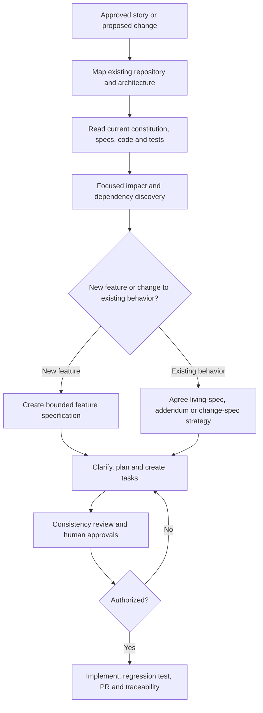

# Brownfield process flow

[← Back to Brownfield README](./README.md)

```mermaid
flowchart TD
 A[Approved story or proposed change] --> B[Map existing repository and architecture]
 B --> C[Read current constitution, specs, code and tests]
 C --> D[Focused impact and dependency discovery]
 D --> E{New feature or change to existing behavior?}
 E -->|New feature| F[Create bounded feature specification]
 E -->|Existing behavior| G[Agree living-spec, addendum or change-spec strategy]
 F --> H[Clarify, plan and create tasks]
 G --> H
 H --> I[Consistency review and human approvals]
 I --> J{Authorized?}
 J -->|No| H
 J -->|Yes| K[Implement, regression test, PR and traceability]
```

For clickable step-by-step links, use the [Brownfield README](./README.md).
