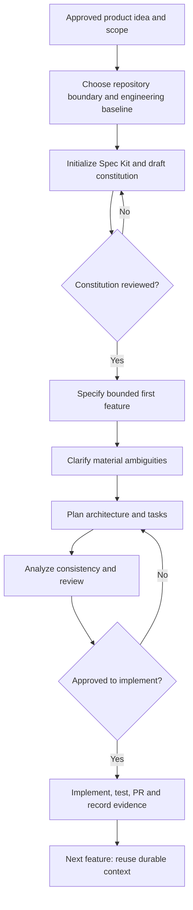

# Greenfield process flow

[← Back to Greenfield README](./README.md)

```mermaid
flowchart TD
 A[Approved product idea and scope] --> B[Choose repository boundary and engineering baseline]
 B --> C[Initialize Spec Kit and draft constitution]
 C --> D{Constitution reviewed?}
 D -->|No| C
 D -->|Yes| E[Specify bounded first feature]
 E --> F[Clarify material ambiguities]
 F --> G[Plan architecture and tasks]
 G --> H[Analyze consistency and review]
 H --> I{Approved to implement?}
 I -->|No| G
 I -->|Yes| J[Implement, test, PR and record evidence]
 J --> K[Next feature: reuse durable context]
```

For clickable step-by-step links, use the [Greenfield README](./README.md).
